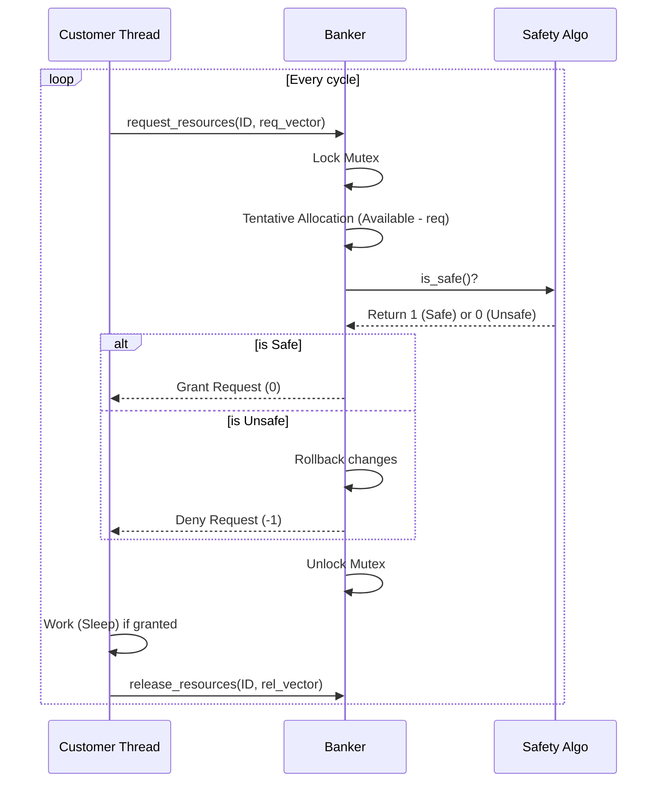

# Multithreaded Banker's Algorithm

## 1. Project Overview

### Goal:

The objective of this project is to implement a multithreaded version of the **Banker's Algorithm** to manage resource allocation and ensure **deadlock avoidance**. By simulating multiple customers (threads) requesting resources concurrently, we demonstrate how to maintain the system in a **Safe State** using mutual exclusion locks (Mutex).

### Core Architecture:

The system consists of a central **Banker** managing shared data structures and $N$ **Customer threads**. Each customer thread operates in a loop: generating a random request, attempting to acquire resources through the banker, performing simulated work (sleep), and finally releasing the resources.

## 2. Team Members and Responsibility

**Chen, Ban-Ban**:  Architect - Thread lifecycle management (creation/joining), file I/O for matrix initialization, and Mutex synchronization.

**Kuan, Chin-Wei**: TBD

**Cheng, Simone**: TBD

**TODO**: 
- Core Safty Algorithm - Implement (`is_safe()`) to determine if a state leads to potential deadlock.
- Resource request/release logic -  Implement request_resources & release_resources, including the rollback mechanism if a state is deemed unsafe.
- load_max_file 
- Verfication

## 3. Implementation Details

### Coordination Agreement

Standardized global data structures: `available`, `maximum`, `allocation`, and `need`. All access to these matrices must be wrapped within `pthread_mutex_lock` to prevent race conditions.

## Design Strategy

* **Simulating Concurrency**: Using `rand()` to generate resource requests mimics unpredictable real-world demand, thoroughly testing the **Deadlock Avoidance** logic.
* **Resource Contention**: Using `sleep()` or `usleep()` forces threads to hold resources. This creates overlap and scarcity, effectively demonstrating the **Safety Algorithm** under pressure.

### Part A: The Architect

* **Command Line Parsing**: Parses initial resource instances from `argv`.
* **Initialization**: Reads `max_requests.txt` to populate the `maximum` matrix.
* **Thread Management**: Creates $N$ threads with unique IDs and handles `pthread_join`.

### Part B: Safety Algorithm

* **State Simulation**: Implements Section 8.6.3.1 logic using local `work` and `finish` arrays.
* **Safe State Check**: Iteratively identifies customers who can complete their tasks to find a safe sequence.

### Part C: Request & Release

* **Pretend Allocation**: Temporarily modifies matrices for a request.
* **Decision Making**: If `is_safe()` returns true, changes are committed; otherwise, values are rolled back.

### Flow/Sequence Diagrams



## 4. Compilation and Configuration Instructions

### Environment:

Ubuntu 20.04 (WSL2), GCC Compiler, POSIX Pthreads Library.

### Command:

To compile the project using the provided Makefile:

```bash
make
```

To run the executable (e.g., with 4 resource types and specific instances):

```bash
./banker 10 5 7 8
```

## 5. The Expected and Final Test Results

### Expected Results:

The program should output logs showing each customer's request status. For example:
`Customer 0: Request granted.`
`Customer 1: Request denied (Unsafe state), waiting...`
`Customer 0: Resources released.`

### Final Results:

*(Place your terminal screenshots here to demonstrate the Banker's Algorithm preventing unsafe allocations)*

## 6. File Structure

* `bankers_algo.c`: Main source code containing thread logic and banker functions.
* `max_requests.txt`: Configuration file defining the maximum resource needs for each customer.
* `Makefile`: Script for automated compilation.
* `README.md`: Project documentation.

## Appendix

* **Reference**: Operating System Concepts, 10th Edition (Silberschatz et al.), Chapter 8 Programming Projects.
